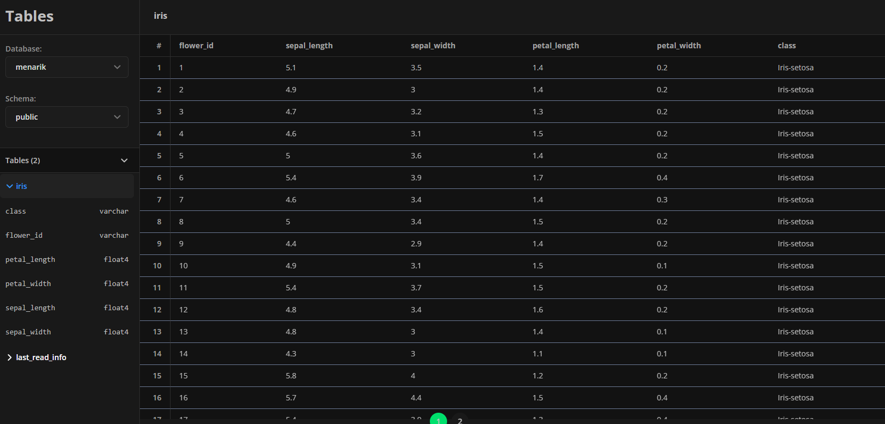

# ETL Project
---

Secara garis besar:
- Ekstrak data dari spreadsheet (diberikan spreadsheet ID)
- Tulis data update di dalam database (disini pakai Neon Tech, Postgresql)

Table dalam database:
- `iris`, berisi data yang ingin dibaca  

- `last_read_info`, berisi informasi kapan terakhir kali baca  

Proses ekstraksi:
- Cek apakah tabel `iris` sudah tersedia, kalau belum buat
- Cek apakah tabel `last_read_info` sudah tersedia, kalau belum buat
- Load data spreadsheet
- Cek di tabel `last_read_info`, apakah tabel `iris` pernah di-load sebelumnya.
- Jika sudah, ekstrak `last_row`
- Jika belum, `last_row` kita asumsikan `0`, 
- kemudian load data dari `last_row + 1` sampai data terupdate
- Kalau jumlah data = 0, tidak perlu dilakukan update.
- Kalau jumlah data > 0, update data baru tadi ke tabel `iris`, kemudian update info pembacaan terakhir ke tabel `last_read_info`